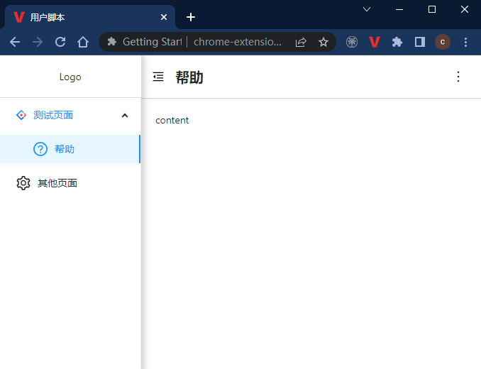
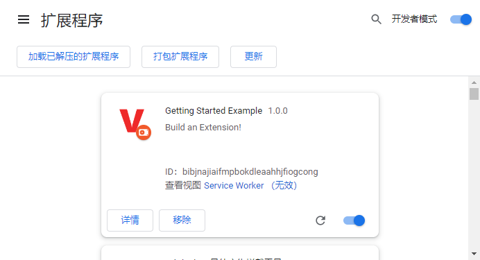
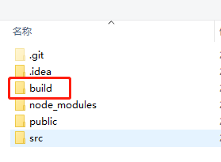

# chrome-extension-v3-antd-react-template
第三版chrome插件开发源码模板。内置react+antd4+ts

Chrome Extensions Version 3.0

> Warning： 因为用的是v3版本的api, 所以Chrome版本必须大于97，否则不兼容。

### 预览图


### useage

1. 克隆项目：
```shell
git clone https://github.com/jsoncode/chrome-extension-v3-antd-react-template.git
```

2. 进入到项目根目录
```shell
cd chrome-extension-v3-antd-react-template
```

3. 安装依赖

```shell
yarn install
```

4. 启动开发模式
```shell
yarn start
```

### 安装插件

1. 打开浏览器插件管理页面
2. 开启开发模式
3. 加载已解压的扩展插件

   

4. 选择项目根目录下，刚生成的build目录，点击确定，即可安装成功。

   


### 其他资料

[Ant Design 文档](https://ant.design)

[Chrome插件开发英文文档V3](https://developer.chrome.com/docs/extensions/mv3/)

[Chrome插件开发中文文档V3](https://doc.yilijishu.info/chrome/)


